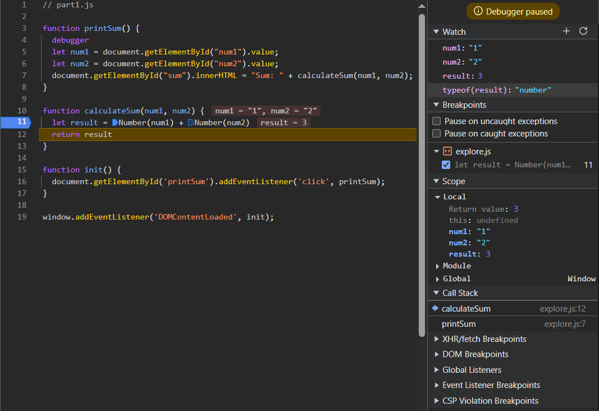

# Lab 4 Explore: Part 2. DevTools - Debugging

1. The bug was that `num1` and `num2` are both treated as strings in the `calculateSum` function, so the `+` operator acts as string concatenation rather than addition. This causes the `result` to be a string concatenation, so when `num1 = '1'` and `num2 = '2'`, `result = '12'` instead of the expected `3`.
2. I would fix it by explicitly converting `num1` and `num2` to `numbers` using the `Number()` function in `calculateSum`.
   